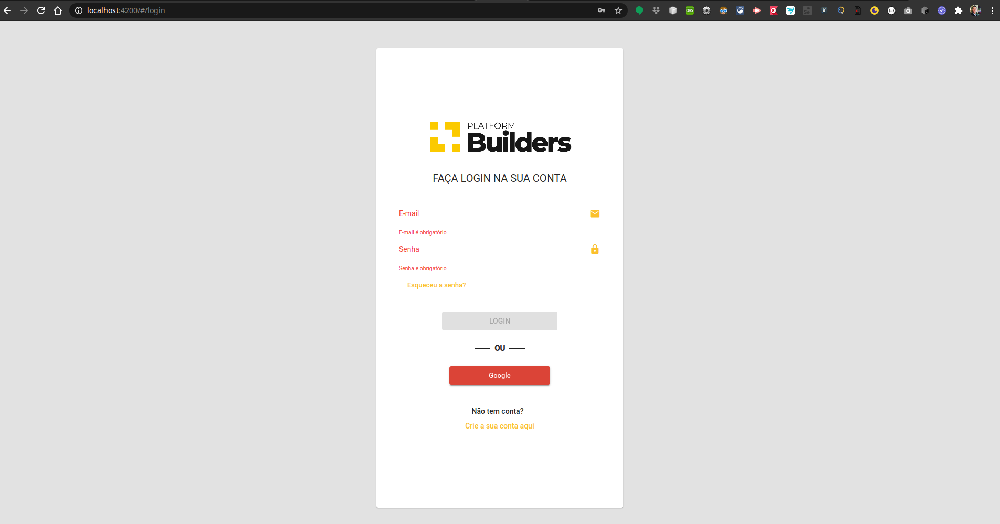
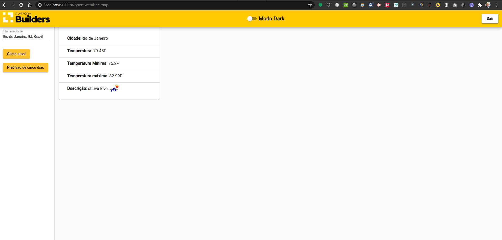
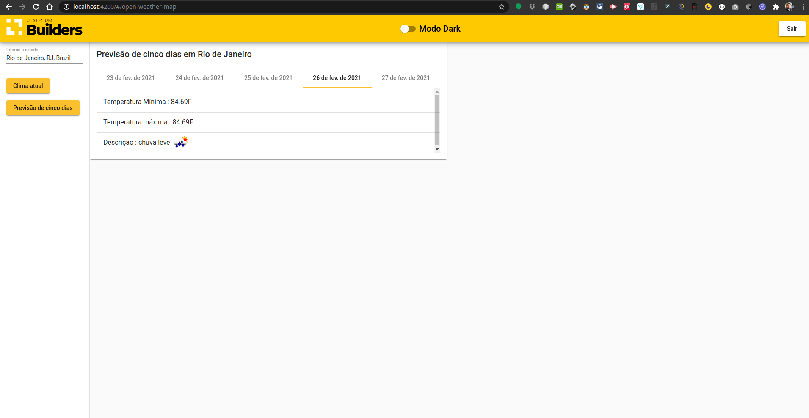

# Platformbuilders

Este projeto foi gerado com [Angular CLI](https://github.com/angular/angular-cli) versão 11.2.1.

## Development server

Primeira vez execute este comando para instalar as dependências:

`npm install`

Execute `npm start` para um servidor de desenvolvimento. Navegue até `http://localhost:4200/`. O aplicativo será recarregado automaticamente se você alterar qualquer um dos arquivos de origem.

**Login:**

**Clima atual:**

**Previsão de 5 dias:** 

## Build

Execute `ng build` para construir o projeto. Os artefatos de construção serão armazenados no diretório `dist/`. Use o sinalizador `--prod` para uma construção de produção.

## Further help

Para obter mais ajuda sobre a CLI Angular, use `ng help` ou confira página [Angular CLI Overview and Command Reference](https://angular.io/cli).
